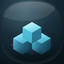

<p align="center">
  
</p>

<h1 align="center">ModelRack</h1>

<p align="center">
  A desktop-native 3D model library for makers who hoard STL, 3MF, STEP, and SCAD files like treasure.
</p>

<p align="center">
  <a href="https://github.com/stormixus/ModelRack/releases/latest"><strong>Download for macOS</strong></a>
  ·
  <a href="https://github.com/stormixus/ModelRack/releases/tag/v0.0.3">v0.0.3 release</a>
</p>

<p align="center">
  <a href="https://github.com/stormixus/ModelRack/actions/workflows/ci.yml"></a>
</p>

---

## Why ModelRack exists

3D-printing folders get messy fast: slicer exports, downloaded model packs, duplicate brackets, half-remembered fan adapters, and that one perfect STL you swear you saved somewhere.

ModelRack turns that chaos into a fast, visual, local-first library:

- browse real model folders without uploading anything
- preview models directly in the app
- inspect geometry, mesh health, plates, and print estimates
- tag, favorite, rename, and track prints through sidecar metadata
- open models in your installed slicer without digging through Finder

It is built for the “I make things” workflow, not a generic file browser with a cube thumbnail taped on top.

## Highlights

### Native macOS feel

- Polished macOS app icon and Dock sizing
- Developer ID signed and Apple-notarized release assets
- Drag-to-Applications DMG installer
- Sidebar toggles, resizable panes, native-ish window controls, and focused keyboard flows

### Model-first browsing

- Grid, masonry, and list views
- Sort by name, modified date, added date, file size, format, triangle count, dimensions, mesh health, and print count
- Filename rename support using desktop conventions
- Context menus for rename, reveal in Finder, copy path/name, favorite, print count, and slicer launch

### 3D preview pipeline

- STL, 3MF, STEP, SCAD, and OBJ-aware scanning paths
- Thumbnail cache for repeat browsing
- Detail preview with orbit/drag interaction
- Multi-plate 3MF plate selection
- Geometry summary and mesh-health surface

### Maker workflow metadata

- Tags and favorites
- Printed count and print history
- Sidecar `.modelrack.json` metadata beside real files
- Printer/profile-backed print estimates
- Slicer discovery and app-specific “Open in …” selection

### Local-first by design

ModelRack works on your folders. Metadata stays local. No account, no cloud sync, no silent upload pipeline.

## Download

The recommended macOS build is the notarized DMG:

- [ModelRack-v0.0.3-macos-arm64.dmg](https://github.com/stormixus/ModelRack/releases/download/v0.0.3/ModelRack-v0.0.3-macos-arm64.dmg)
- SHA-256: `807ccca8259f513af5586eeb9bb9d77d5dc54eccf14c14138f1dc5bcc3903b5b`

Alternative zip builds are also attached to the release page.

> Current release target: Apple Silicon macOS. Windows/Linux support is planned but not release-verified yet.

## Build from source

Requirements:

- Rust stable
- Xcode command line tools on macOS

```bash
git clone https://github.com/stormixus/ModelRack.git
cd ModelRack
cargo run
```

Build a macOS app bundle:

```bash
./scripts/build-macos-app.sh --release
```

Create a polished DMG installer:

```bash
MODELRACK_SIGN_IDENTITY="Developer ID Application: Your Name (TEAMID)" \
  ./scripts/create-macos-dmg.sh --keychain-profile modelrack
```

## Release tooling

ModelRack includes scripts for repeatable macOS distribution:

- `scripts/generate-app-icon.sh` — regenerate `.icns` and iconset assets
- `scripts/build-macos-app.sh` — build the `.app` bundle with ad-hoc or Developer ID signing
- `scripts/notarize-macos-app.sh` — submit, staple, and validate the app bundle
- `scripts/create-macos-dmg.sh` — create the drag-to-Applications DMG and optionally notarize it

## Tech stack

- Rust core
- Slint UI
- Native macOS packaging/signing/notarization scripts
- Local scanner and thumbnail cache for 3D model libraries

## Status

ModelRack is early alpha software, actively shaped around real maker-library workflows. Expect sharp edges, especially around unusual CAD/model files and cross-platform packaging.

The goal is simple: make your 3D model folder feel like a proper workshop wall, not a junk drawer.
