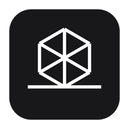

<p align="center">
  
</p>

<h1 align="center">ModelRack</h1>

<p align="center">
  <strong>A gorgeous, desktop-native 3D model manager for makers who hoard STL, 3MF, STEP, and SCAD files like treasure.</strong>
</p>

<p align="center">
  <a href="https://github.com/stormixus/ModelRack/actions/workflows/ci.yml">
    
  </a>
  <a href="https://github.com/stormixus/ModelRack/releases/latest">
    
  </a>
  
  
</p>

<p align="center">
  <a href="#-key-features">Key Features</a> •
  <a href="#-download--installation">Download</a> •
  <a href="#%EF%B8%B0-build-from-source">Build</a> •
  <a href="#%EF%B8%B0-tech-stack">Tech Stack</a>
</p>

---

## 💡 Why ModelRack?

3D-printing folders get messy incredibly fast: slicer exports, downloaded model packs, duplicate brackets, half-remembered fan adapters, and that one perfect STL you swear you saved somewhere. 

**ModelRack** turns that chaos into a **fast, visual, local-first library**. It is built specifically for the "I make things" workflow, not a generic file browser with a boring cube thumbnail taped on top. Your 3D model folder should feel like a proper, neatly organized workshop pegboard, not a chaotic junk drawer.

---

## ✨ Key Features

### 🖥️ Native & Blazing Fast
*   **Rust Engine**: Blazing-fast performance and negligible memory footprint.
*   **GPU-Accelerated Slint UI**: Glassmorphic aesthetics, fluid transitions, and dynamic dark/light themes.
*   **Customization**: Choose your favorite accent colors (Teal, Amber, Blue, Coral, Emerald, Purple) and layout densities.

### 📐 Multi-Format 3D Scanner
*   **Deep File Scanning**: Out-of-the-box support for **STL, 3MF, STEP, SCAD, and OBJ**.
*   **Advanced STEP Meshing**: High-fidelity native B-rep curve parsing and triangle reconstruction without mesh tearing.
*   **OpenSCAD CLI Integration**: Automatic detection of `openscad` to render precise CAD previews for `.scad` scripts.

### 🎨 High-Fidelity 3D Orbit Viewer
*   **Interactive 3D Preview**: Smooth rotation, panning, and zoom directly within the detail panel.
*   **3MF Plate Management**: View and switch between multiple build plates within complex `.3mf` project files.
*   **Mesh Health Surface Check**: Immediate reporting of dimensions, volume, triangle count, and non-manifold mesh status.

### 🏷️ Maker Workflow Metadata
*   **Tagging & Favorites**: Tag, categorize, and favorite models in a structured hierarchy.
*   **Print History**: Track print count and history to see what you actually make.
*   **Local-First Sidecars**: All tags, history, and notes are saved directly in a companion `.modelrack.json` file beside your real models. **No accounts, no cloud, 100% privacy.**

### 🌐 Cross-Platform & Localized
*   **Slicer Launcher**: Automatic discovery of OrcaSlicer, Bambu Studio, PrusaSlicer, and SuperSlicer for instant double-click loading.
*   **OS Language Auto-Detection**: Instant native translation matching your system locale. Supports **English, 한국어, 日本語, Español, Português, Русский, 简体中文, and 繁體中文**.

---

## 📦 Download & Installation

ModelRack is distributed via GitHub Actions as fully compiled desktop packages for every tagged release:

| Platform | Recommended Installer | Portables / Fallbacks |
| :--- | :--- | :--- |
| **macOS** | [**Apple-Notarized DMG**](https://github.com/stormixus/ModelRack/releases/latest) (Apple Silicon / Intel) | `.zip` App Bundle |
| **Windows** | [**WiX MSI Installer**](https://github.com/stormixus/ModelRack/releases/latest) (x64 / ARM64) | Portable `.exe` / `.zip` |
| **Linux** | [**Debian .deb Package**](https://github.com/stormixus/ModelRack/releases/latest) (Ubuntu/Debian) | Portable `.tar.gz` |

---

## 🛠️ Build from Source

### Requirements
*   **Rust Stable** (2021 edition)
*   **macOS**: Xcode Command Line Tools.
*   **Windows**: WiX Toolset v3 (optional, for MSI packaging).
*   **Linux**: `pkg-config`, `libfontconfig1-dev`, `libxkbcommon-dev`, `libxcb1-dev`, `libwayland-dev`, `libudev-dev`.

### Standard Run
```bash
# Clone the repository
git clone https://github.com/stormixus/ModelRack.git
cd ModelRack

# Run the app locally
cargo run --release
```

### Packaging & Compilation Scripts
We include native packaging and build scripts inside the `scripts/` folder:

*   **macOS App Bundle & DMG**:
    ```bash
    # Build app bundle
    ./scripts/build-macos-app.sh --release
    
    # Pack into a custom-styled DMG installer
    MODELRACK_SIGN_IDENTITY="Developer ID Application: Your Name (TEAMID)" \
      ./scripts/create-macos-dmg.sh --keychain-profile modelrack
    ```
*   **Windows MSI & Portable Packages**:
    ```powershell
    # Run from Developer PowerShell
    ./scripts/build-windows-packages.ps1 -RequireMsi
    ```
*   **Linux Portable & Debian Packages**:
    ```bash
    ./scripts/build-linux-packages.sh
    ```

---

## 🧩 Tech Stack

*   **Core**: Rust
*   **UI Layer**: Slint UI (Declarative GPU-accelerated markup)
*   **Database**: SQLite (via `rusqlite` with bundled bindings)
*   **Geometry Parsing**: Native B-rep CAD polygon mesh engines

---

## ⚠️ Project Status

ModelRack is early desktop software actively shaped around real maker-library workflows. Expect sharp edges, especially around unusual CAD/model files and cross-platform packaging. 

Our goal is simple: **make your 3D model folder feel like a proper workshop wall, not a junk drawer.** 🛠️
