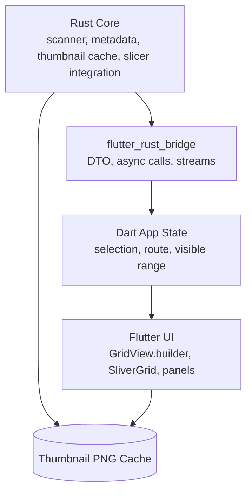

# ModelRack UI 아키텍처 평가: Slint 유지 최적화 vs Flutter 전환

본 문서는 ModelRack의 대용량 3D 모델 라이브러리 스크롤 끊김(Stutter/Jank) 문제를 기준으로, 현행 **Slint UI**를 계속 최적화할지 또는 **Flutter UI**로 전환할지 평가합니다.

검토 기준은 다음과 같습니다.

- 현재 저장소 상태: `Cargo.toml` 기준 ModelRack `0.1.3`, Slint `1.16.1`, `renderer-software` 사용.
- 현행 UI 규모: `ui/modelrack.slint` 약 250KB, 4,931라인.
- 성능 증상: 대용량 카드 그리드/리스트에서 스크롤 중 프레임 드랍 또는 입력 지연이 발생한다고 가정.
- 성능 수치: 아직 계측 결과가 없으므로, 본 문서의 판단은 코드 구조와 프레임워크 특성에 기반한 사전 평가입니다. 최종 전환 여부는 계측으로 결정해야 합니다.

## 1. 결론 요약

**권고: 즉시 Flutter로 전면 마이그레이션하지 말고, 먼저 Slint 유지 최적화를 1차로 수행합니다.**

현재 병목의 핵심은 “Slint 전체의 근본 한계”라기보다, ModelRack의 현행 구현이 `Flickable` 안에서 전체 `model-cards`를 반복 생성하고, UI 적용 경로에서 썸네일 이미지를 동기 로드할 수 있는 구조에 있습니다.

Flutter는 `GridView.builder`/`SliverGrid` 기반의 지연 빌드, 풍부한 위젯 생태계, 핫 리로드 측면에서 강력한 선택지입니다. 다만 250KB 규모의 Slint 마크업과 8천 라인대의 `src/slint_shell.rs` 통합 코드를 새 UI 스택으로 옮겨야 하므로, 성능 병목이 Slint 최적화로 해결되지 않는다는 계측 근거가 필요합니다.

전환 판단은 다음 게이트를 통과할 때만 권장합니다.

| 판단 항목 | Flutter 전환을 검토할 조건 |
| :--- | :--- |
| 스크롤 성능 | Slint에서 카드 가상화/페이징과 이미지 비동기화를 적용한 뒤에도 5k~10k 카드 라이브러리에서 목표 프레임 타임을 안정적으로 만족하지 못함 |
| 제품 방향 | 고급 위젯, 복잡한 상태 전환, 다중 플랫폼 UI 확장, 더 빠른 UI 반복 개발이 핵심 로드맵이 됨 |
| 팀/배포 비용 | Dart/Flutter 툴체인, Rust 동적 라이브러리 패키징, 코드 생성, macOS/Windows/Linux QA 비용을 감수할 수 있음 |

## 2. 현행 병목 분석

### 2.1 현재 구현은 카드 전체를 UI 요소로 생성한다

`ui/modelrack.slint`의 브라우저 영역은 그리드/메이슨리와 리스트 모두 `Flickable`을 직접 사용합니다.

- 그리드/메이슨리: `for card[index] in model-cards: ModelCard`
- 리스트: `for card[index] in model-cards: ModelListRow`
- `viewport-height`는 전체 행 수 기준으로 계산됩니다.
- 그리드 카드는 `visible: true`로 유지되며, 주석상 `Flickable` 클리핑에 의존합니다.

이 구조에서는 화면 밖 카드도 Slint 요소로 존재합니다. 따라서 카드 수가 수천 개로 늘어나면 레이아웃 계산, 속성 평가, 이미지 속성 보관, 이벤트 대상 관리 비용이 카드 수에 비례해 증가합니다.

중요한 구분점이 있습니다. Slint 공식 `ListView`는 보이는 요소만 인스턴스화하는 동작을 제공합니다. 따라서 문제를 “Slint는 가상화를 지원하지 않는다”로 적는 것은 부정확합니다. 더 정확한 표현은 다음입니다.

> ModelRack의 현재 브라우저 구현은 Slint의 가상화 가능한 `ListView`가 아니라, 커스텀 `Flickable`과 전체 `for` 반복으로 그리드/리스트를 구성한다. 이 때문에 현재 구현은 뷰포트 가상화를 얻지 못한다.

### 2.2 썸네일 로드는 UI 적용 경로에서 동기 비용을 만들 수 있다

스캔 경로는 별도 스레드에서 동작하고, `thumbnail_cache::ensure_thumbnail`로 디스크 PNG를 생성합니다. 이 부분은 UI 스레드와 분리되어 있습니다.

문제는 Slint에 넘길 `BrowserCard`를 만들 때입니다.

- `apply_snapshot`은 스냅샷의 모든 카드를 `browser_card()`로 변환합니다.
- `browser_card()`는 `load_thumbnail_image(card.thumb_path.as_deref())`를 호출합니다.
- `load_ui_image()`는 `UI_IMAGE_CACHE`에 캐시가 없으면 `slint::Image::load_from_path(path)`를 호출합니다.

즉, 캐시가 비어 있는 첫 노출 또는 캐시 무효화 직후에는 UI 적용 과정에서 파일 로드와 이미지 디코딩이 발생할 수 있습니다. 캐시는 반복 비용을 줄이지만, 첫 로드의 프레임 드랍 가능성은 없애지 못합니다.

Slint의 `Image`는 `Send`가 아니므로 이미지를 그대로 작업 스레드에서 만들어 UI 스레드로 옮길 수 없습니다. 대신 공식 문서가 안내하는 것처럼, 작업 스레드에서 `SharedPixelBuffer`를 만들고 UI 이벤트 루프에서 `Image::from_rgba8` 또는 `Image::from_rgba8_premultiplied`로 변환하는 방식이 Slint 유지 최적화의 현실적인 경로입니다.

### 2.3 데이터 동기화는 개선되어 있지만, 노출 카드 수 자체를 줄이지 않는다

`sync_browser_cards()`는 기존 `VecModel<BrowserCard>`를 재사용하고, stable key가 같은 항목은 필요한 행만 갱신합니다. 이는 좋은 최적화입니다.

다만 이 함수는 최종적으로 전체 표시 대상 카드 벡터를 Slint 모델에 유지합니다. 따라서 “카드 변경량”은 줄이지만 “UI에 존재하는 카드 수”를 줄이지는 못합니다. 대용량 라이브러리의 스크롤 성능을 해결하려면 동기화 최적화와 별개로 뷰포트 기반 노출 수 제한이 필요합니다.

### 2.4 애니메이션은 부차 병목이다

`ModelCard`는 `x`, `y`, `width`, `height`, `background`, `border-color` 등에 애니메이션을 둡니다. 현재 코드에는 이미 완화 장치가 있습니다.

- `full-layout-motion: model-cards.length <= 96`
- `streaming-list: scan-progress-percent >= 0 && model-cards.length <= 96`

따라서 애니메이션은 의심 지점이지만 1순위 원인으로 단정하기 어렵습니다. 먼저 카드 전체 생성과 이미지 로드 경로를 줄인 뒤, 남는 프레임 드랍이 있을 때 애니메이션을 추가로 줄이는 순서가 맞습니다.

## 3. Slint 유지 최적화 전략

Flutter 전환 전에 아래 순서로 Slint 경로를 검증합니다. 각 단계는 독립적으로 계측 가능해야 합니다.

### Phase 0: 기준 성능 계측

목표는 “느린 것 같다”를 “어디서 몇 ms가 쓰이는지”로 바꾸는 것입니다.

- 1k, 5k, 10k 모델 항목을 가진 테스트 라이브러리를 준비합니다.
- `apply_snapshot`, `browser_card`, `load_ui_image`, `sync_browser_cards`에 소요 시간과 호출 횟수 로그를 추가합니다.
- 썸네일 캐시가 차가운 상태와 따뜻한 상태를 분리해 측정합니다.
- 스크롤 중 프레임 타임, UI 스레드 블로킹, 이미지 로드 횟수를 기록합니다.

성공 기준 예시는 다음과 같습니다.

- 따뜻한 캐시 상태에서 5k 카드 스크롤 중 체감 가능한 멈춤이 없어야 합니다.
- 차가운 캐시 상태에서도 이미지 로드가 한 프레임에 몰리지 않아야 합니다.
- `apply_snapshot`이 카드 수에 선형으로 커지더라도, 스크롤 이벤트마다 전체 카드 변환이 반복되지 않아야 합니다.

### Phase 1: Slint 안에서 노출 카드 수 제한

현재 구조의 가장 큰 개선점은 `model-cards` 전체를 UI 반복 대상으로 넘기지 않는 것입니다.

권장 방향은 다음입니다.

1. Rust 쪽에는 전체 `BrowserCardVm` 목록을 유지합니다.
2. Slint에는 현재 뷰포트와 앞뒤 버퍼에 필요한 카드만 넘깁니다.
3. 그리드/메이슨리에서는 전체 높이를 유지하되, 실제 `ModelCard` 인스턴스는 보이는 행 주변만 생성합니다.
4. 리스트 모드는 가능하면 Slint `ListView` 전환을 검토합니다. 단, ModelRack의 행 높이, 선택, 컨텍스트 메뉴, 커스텀 배치 요구와 충돌하는지 먼저 프로토타입으로 확인합니다.

이 접근은 Flutter의 `GridView.builder`와 같은 완성형 지연 빌드는 아니지만, 현행 전면 반복 구조의 비용을 큰 폭으로 줄일 수 있습니다.

### Phase 2: 썸네일 UI 캐시 비동기화

현재 `UI_IMAGE_CACHE`는 `slint::Image`를 캐시합니다. 이를 다음 구조로 바꾸는 것을 검토합니다.

- 스캔/프리로드 작업 스레드가 PNG 파일을 읽고 RGBA 버퍼로 디코딩합니다.
- UI 스레드는 준비된 버퍼를 받아 Slint `Image`로 변환합니다.
- 화면 근처 카드만 우선 프리로드합니다.
- `thumb_revision`은 파일 경로 문자열만이 아니라 캐시 버전, 파일 크기, 수정 시각 또는 썸네일 생성 revision을 반영해야 합니다.

이 구조는 디스크 I/O와 디코딩을 UI 적용 경로에서 분리합니다. 또한 사용자가 “썸네일 재생성” 또는 “캐시 삭제”를 실행했을 때 UI 캐시가 확실히 무효화되는 장점도 있습니다.

### Phase 3: 애니메이션과 시각 효과 후순위 정리

Phase 1~2 뒤에도 프레임 드랍이 남는 경우에만 카드 애니메이션을 더 줄입니다.

- 대용량 라이브러리에서는 `background`/`border-color` 애니메이션도 선택/호버 이벤트에만 제한합니다.
- 레이아웃 변경 애니메이션은 밀도/뷰 모드 변경 직후의 짧은 구간에만 허용합니다.
- 스캔 중 카드 등장 애니메이션은 이미 96개 이하로 제한되어 있으므로, 추가 변경은 계측 후 결정합니다.

## 4. Flutter 전환 시 기대효과와 비용

### 4.1 기대효과

Flutter 전환의 가장 큰 장점은 대용량 스크롤 UI를 프레임워크의 기본 패턴으로 풀 수 있다는 점입니다.

- `GridView.builder`는 큰 그리드에서 실제로 보이는 자식 위젯 중심으로 빌드됩니다.
- `SliverGrid`/`CustomScrollView` 조합으로 그리드, 섹션, 상태 패널을 자연스럽게 구성할 수 있습니다.
- `Image.file`/`FileImage`는 Flutter `ImageCache`와 연동되며, `cacheWidth`/`cacheHeight`로 디코딩 크기를 줄일 수 있습니다.
- Flutter 개발 환경은 UI 반복 개발, 디버깅, 위젯 생태계 측면에서 Slint보다 유리합니다.

다만 Flutter가 “자동으로 완벽한 스크롤 성능”을 보장하는 것은 아닙니다. 로컬 파일 이미지가 한 번에 많이 디코딩되거나, 카드 위젯이 무겁거나, Rust-Dart 브릿지에서 과도한 데이터 복사가 발생하면 Flutter에서도 jank가 생깁니다.

### 4.2 마이그레이션 비용

Flutter 전환은 UI 파일 교체 이상의 작업입니다.

- `ui/modelrack.slint`의 레이아웃, 상태, 컴포넌트, 팝업, 설정 패널을 Dart 위젯으로 재작성해야 합니다.
- `src/slint_shell.rs`의 콜백 바인딩, 상태 적용, 창 제어, 폴더 선택, 설정 저장, 썸네일 표시 경로를 새 브릿지 API로 쪼개야 합니다.
- Rust 코어는 정적 링크된 UI 크레이트가 아니라 Flutter 앱에서 로드하는 동적 라이브러리 또는 플랫폼별 번들로 배포되어야 합니다.
- macOS 코드사인/노터라이즈, Windows DLL 배포, Linux 패키징, CI 캐시, 릴리즈 QA 매트릭스가 변경됩니다.
- 현재 `docs/slint-migration.md`가 Slint를 활성 UI 계약으로 선언하고 있으므로, 새 ADR 또는 migration decision 문서가 필요합니다.

## 5. Flutter + Rust 통합 설계안

Flutter를 선택한다면 Rust 도메인 로직은 유지하고, UI 셸만 교체합니다.



권장 경계는 다음과 같습니다.

- Rust가 계속 소유: 스캔, 파일 감시, sidecar metadata, 태그/프린트 기록, 썸네일 생성, slicer discovery/launch.
- Flutter가 소유: 위젯 트리, 스크롤 컨트롤러, 선택/호버/팝업 표현, 접근성 라벨, 테마 표현.
- 공유 DTO: `BrowserCardDto`, `BrowserQuery`, `BrowserPage`, `ScanEvent`, `ThumbnailRef`.
- 썸네일 전달: 기본은 파일 경로와 revision을 전달합니다. 원시 픽셀 `Vec<u8>` zero-copy 전송은 상세 프리뷰처럼 꼭 필요한 경로에만 제한합니다.

예상 API 형태는 다음과 같습니다.

```rust
pub struct BrowserQuery {
    pub filter_key: String,
    pub search_text: String,
    pub sort_key: String,
    pub ascending: bool,
    pub offset: u32,
    pub limit: u32,
}

pub struct BrowserPage {
    pub total: u32,
    pub items: Vec<BrowserCardDto>,
}

pub struct ThumbnailRef {
    pub path: String,
    pub revision: String,
}
```

주의할 점은 `flutter_rust_bridge`의 zero-copy가 모든 객체에 자동 적용되는 만능 해결책은 아니라는 것입니다. 최신 문서 기준으로 `Vec<u8>` 같은 바이트 버퍼의 Rust-to-Dart 비동기/스트리밍 경로에서 유효한 최적화로 보는 편이 안전합니다. 카드 메타데이터는 작은 DTO로 보내고, 큰 바이너리는 정말 필요한 경로에만 제한해야 합니다.

## 6. 비교표

| 평가 항목 | 현행 ModelRack Slint | Slint 최적화 후 기대 | Flutter 전환 기대 | 판단 |
| :--- | :--- | :--- | :--- | :--- |
| 대용량 그리드 스크롤 | `Flickable` + 전체 `for` 반복으로 카드 수에 비례 | 커스텀 뷰포트 페이징 구현 시 개선 가능 | `GridView.builder`/`SliverGrid`로 기본 패턴 우수 | Flutter 우세, 단 Slint도 구조 개선 여지 있음 |
| 리스트 스크롤 | 현재는 `Flickable` + 전체 `for` 반복 | Slint `ListView` 프로토타입 가능 | `ListView.builder`로 기본 패턴 우수 | 양쪽 모두 개선 가능 |
| 이미지 로드 | UI 캐시 miss 시 `load_from_path` 비용 가능 | 작업 스레드 디코딩 + UI 변환으로 개선 가능 | `ImageCache`, `cacheWidth`, `precacheImage` 활용 가능 | Flutter가 편하지만 Slint도 해결 가능 |
| 개발 생산성 | Rust/Slint 재컴파일 중심 | 유지 비용 낮음, 기존 코드 재사용 | 핫 리로드와 위젯 생태계 강점 | Flutter 우세 |
| 배포/패키징 | 단일 Rust 앱 구조가 단순 | 기존 QA 유지 | Flutter 앱 + Rust 라이브러리 번들 필요 | Slint 우세 |
| 메모리 기준선 | 프레임워크 오버헤드는 낮으나 현재 전체 카드 생성 비용 큼 | 카드 수 제한 시 낮은 기준선 유지 가능 | Flutter 엔진/ImageCache 기준선 증가 | Slint 우세 가능 |
| 마이그레이션 리스크 | 없음 | 낮음~중간 | 높음. UI 전면 재작성과 브릿지 설계 필요 | Slint 최적화 선행 권장 |

## 7. 권장 로드맵

### 1단계: 계측과 Slint 구조 개선

- 대용량 테스트 라이브러리를 만들고 현행 스크롤/이미지 로드 비용을 측정합니다.
- 그리드/리스트에 뷰포트 기반 카드 노출 제한을 적용합니다.
- 썸네일 UI 로드를 작업 스레드 디코딩 + UI 스레드 이미지 변환 구조로 바꿉니다.
- 캐시 revision을 파일 경로 외 정보까지 포함하도록 정리합니다.

이 단계의 목표는 “Flutter가 필요하다”를 증명하는 것이 아니라, “현재 Slint 구조에서 해결 가능한 병목인지”를 확인하는 것입니다.

### 2단계: Flutter spike

Slint 최적화와 병행하거나 그 직후, 작은 Flutter spike를 별도 브랜치에서 수행합니다.

- Rust에서 5k~10k `BrowserCardDto`를 제공하는 최소 FFI API를 만듭니다.
- Flutter에서 `GridView.builder`로 카드 제목, 경로, 썸네일 파일 이미지만 표시합니다.
- 검색/정렬/상세 패널/설정은 제외합니다.
- 동일 데이터셋에서 스크롤 프레임 타임과 이미지 로드 체감을 비교합니다.

이 spike는 제품 기능 완성이 아니라 전환 타당성 검증용이어야 합니다.

### 3단계: 전환 또는 유지 결정

다음 중 하나를 선택합니다.

- Slint 최적화가 목표 성능을 만족하면 Slint 유지. Flutter 전환 문서는 장기 옵션으로 보관합니다.
- Slint 최적화가 실패하고 Flutter spike가 명확히 우수하면 Flutter 전환 ADR을 작성합니다.
- Flutter spike 성능은 좋지만 마이그레이션 비용이 큰 경우, Slint 유지 + 특정 화면만 재설계하는 절충안을 검토합니다.

## 8. 최종 판단

현재 정보만으로는 Flutter 전면 마이그레이션을 바로 시작하기보다, Slint의 현행 구현 병목을 먼저 줄이는 것이 더 안전합니다. 병목은 크게 두 가지입니다.

1. 전체 `model-cards`를 한 번에 UI 요소로 생성하는 브라우저 구조.
2. 썸네일 이미지가 UI 적용 경로에서 동기 로드될 수 있는 구조.

이 둘은 Flutter로 갈 경우 자연스럽게 해소될 가능성이 높지만, Slint 안에서도 구조적으로 개선할 수 있습니다. 따라서 Flutter는 “성능 문제가 있으니 즉시 교체”가 아니라, **Slint 최적화 후에도 대용량 라이브러리 목표 성능을 만족하지 못할 때 선택하는 중장기 피벗**으로 두는 것이 합리적입니다.

## 참고 자료

- Local: `ui/modelrack.slint` - 브라우저 `Flickable`, `ModelCard`, `model-cards` 반복 구조.
- Local: `src/slint_shell.rs` - `apply_snapshot`, `sync_browser_cards`, `load_ui_image`, `UI_IMAGE_CACHE`.
- Local: `src/view_model.rs` - `AppViewSnapshot`, `BrowserCard`, 표시 카드 생성.
- Slint docs: [ListView](https://docs.slint.dev/latest/docs/slint/reference/std-widgets/views/listview/)는 보이는 요소만 인스턴스화하는 리스트 위젯을 제공합니다.
- Slint docs: [Image](https://docs.slint.dev/latest/docs/rust/slint/struct.Image) 문서는 `Image`가 `Send`가 아니며, 작업 스레드에서 픽셀 버퍼를 만든 뒤 UI 이벤트 루프에서 이미지로 변환하는 방식을 안내합니다.
- Flutter docs: [GridView.builder](https://api.flutter.dev/flutter/widgets/GridView/GridView.builder.html)는 큰 그리드에서 필요한 자식을 지연 생성하는 기본 선택지입니다.
- Flutter docs: [Image.file](https://api.flutter.dev/flutter/widgets/Image/Image.file.html), [ImageCache](https://api.flutter.dev/flutter/painting/ImageCache-class.html)는 로컬 파일 이미지 캐시와 디코딩 크기 조절의 근거입니다.
- flutter_rust_bridge docs: [Zero copy](https://cjycode.com/flutter_rust_bridge/guides/types/translatable/zero-copy)는 바이트 버퍼 전달 최적화의 적용 범위를 설명합니다.
